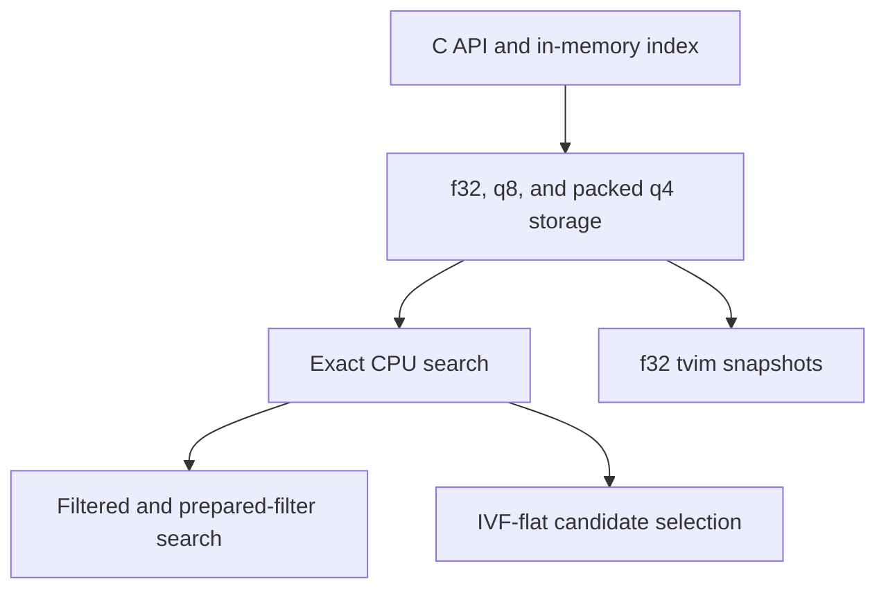

# Vector Index

`ggml-vector-index` is an opt-in C API for local vector search. It stores caller
provided ids with dense vectors and exposes exact top-k search over f32, q8, and
packed q4 storage.

This candidate component is currently standalone. It is not enabled in default
builds and is not wired into the llama runtime, server, or app paths. Consumers
should enable it explicitly and link the vector-index target directly.

## How The Pieces Fit

The vector index is organized as layers. This revision provides the public C
API, in-memory storage, exact search, filtering, IVF-flat search, and limited
persistence for the generic f32/q8/q4 storage modes.



The public C API owns the opaque index handle, caller-provided ids, vector
slots, mutations, and the top-k result contract. f32 storage and exact search
form the correctness baseline used to validate compressed or approximate paths.

Generic q8 and packed q4 modes reduce memory used by CPU-resident vectors. Each
vector stores an f32 scale, and search scores f32 queries directly against the
quantized codes.

Exact search scans every live slot. Filtered search restricts that scan to a
caller-provided id set, while prepared filters cache the id-to-slot mapping for
repeated queries. IVF-flat reduces the number of vectors scored by assigning
vectors and queries to in-memory centroid lists. It is an optional search
accelerator and does not change the storage format.

The current persistence implementation supports complete f32 (`bit_width=32`)
`.tvim` snapshots. q4/q8 snapshots, mmap loading, `.tvid` mutation logs, and
delta compaction are reserved API surface and return explicit unsupported errors
until their implementations land.

TurboVec-style q2/q4 search, rotations, TQ+ calibration, Lloyd-Max codebooks,
LUT scoring, blocked-code caches, and related golden fixtures are planned work.
They are not implemented by this component revision.

Each implemented layer carries its own regression coverage: result ordering,
architecture parity, f32 snapshot round trips and corruption handling,
unsupported persistence entry points, IVF cache invalidation, benchmark
coverage, and package smoke tests.

## Build

Enable the library with `GGML_VECTOR_INDEX`:

```sh
cmake -B build -DGGML_VECTOR_INDEX=ON -DLLAMA_BUILD_TESTS=ON
cmake --build build --target ggml-vector-index test-vector-index
```

Installed CMake packages export the target as `ggml::vector-index`.

```cmake
target_link_libraries(my_target PRIVATE ggml::vector-index)
```

NEON kernels are selected automatically on supported ARM builds. On x86,
AVX2 kernels are built separately when `GGML_NATIVE=ON` or `GGML_AVX2=ON` and
are selected at runtime. Scalar and SIMD reduction order can produce small
score differences across CPU architectures.

## Storage Modes

Create an index with a fixed dimension and bit width:

- `bit_width=32`: full f32 vectors.
- `bit_width=8`: per-vector symmetric q8 storage with f32 scales.
- `bit_width=4`: per-vector symmetric packed q4 storage with f32 scales.

The generic q4/q8 layouts are local to vector-index and are not `ggml-quants`
block formats. They keep one scale per external vector for random row lookup and
delete/compact operations. Persistence for q4/q8 storage is not implemented yet.

Search scores are dot products. The index does not normalize vectors internally.
For cosine similarity, normalize vectors before insertion and normalize queries
before search.

## Search Modes

- Exact search (`ggml_vec_index_search`) scans every live slot.
- Filtered search (`ggml_vec_index_search_filtered`) restricts that scan to
  caller-provided ids.
- Prepared-filter search (`ggml_vec_index_filter_create` and
  `ggml_vec_index_search_prepared_filtered`) caches the id-to-slot mapping for
  repeated calls. The source index must outlive the filter, and the filter may
  be used only with that same index handle. An `add` that inserts one or more
  vectors, a successful `remove`, or a `compact` that removes tombstones makes
  the filter stale. Subsequent searches with it return
  `GGML_VEC_INDEX_E_INVALID_ARG`.
- IVF-flat search (`ggml_vec_index_build_ivf` and
  `ggml_vec_index_search_ivf`) builds heap-owned state for approximate candidate
  selection. Call `ggml_vec_index_build_ivf` before the first IVF search.
  Rebuild it after loading an index, after an `add` that inserts one or more
  vectors, after a successful `remove`, and after a `compact` that removes
  tombstones. Until it is built or rebuilt, IVF search returns
  `GGML_VEC_INDEX_E_INVALID_ARG`. `nprobe` must be at least 1. Lower values
  search fewer lists and may return different results from exact search.
  Probing at least the number of built lists searches all lists, so candidate
  coverage matches exact search. IVF state is not persisted in snapshots.
