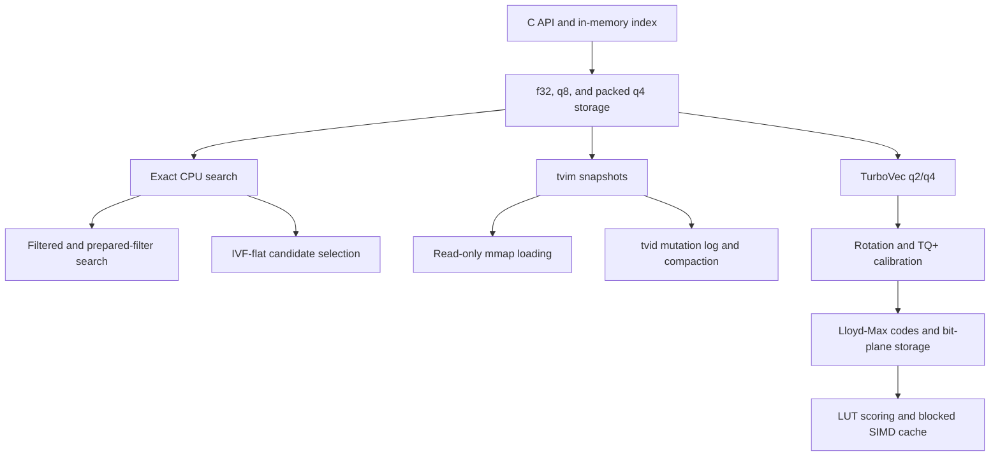

# Vector Index

`ggml-vector-index` is an opt-in C API for local vector search. It stores caller
provided ids with dense vectors and exposes exact top-k search over f32, q8, and
packed q4 storage.

This candidate component is currently standalone. It is not enabled in default
builds and is not wired into the llama runtime, server, or app paths. Consumers
should enable it explicitly and link the vector-index target directly.

## How The Pieces Fit

The vector index is organized as layers. The storage, search, and persistence
layers are general vector-index infrastructure; TurboVec is the q2/q4 algorithm
built on top of them.



The public C API owns the opaque index handle, caller-provided ids, vector
slots, mutations, and the top-k result contract. f32 storage and exact search
form the correctness baseline used to validate compressed or approximate paths.

Generic q8 and packed q4 modes reduce memory used by CPU-resident vectors. Each
vector stores an f32 scale, and search scores f32 queries directly against the
quantized codes. These modes also provide comparison points for TurboVec q2/q4
quality and performance.

Exact search scans every live slot. Filtered search restricts that scan to a
caller-provided id set, while prepared filters cache the id-to-slot mapping for
repeated queries. IVF-flat reduces the number of vectors scored by assigning
vectors and queries to in-memory centroid lists. It is an optional search
accelerator and does not change the storage format.

A `.tvim` file is a complete index snapshot. Normal loading materializes the
index in memory, while mmap loading keeps supported vector sections mapped
read-only for faster startup and lower memory duplication. A `.tvid` file
records incremental add and remove operations after a snapshot. Replay
reconstructs the latest state, and compaction replaces the snapshot and resets
the log. State identities and file locking prevent stale or concurrent writers
from silently producing a divergent index.

TurboVec is a separate compressed search mode built on the same index API.
Vectors and queries are rotated into a quantization-friendly space. TQ+
calibration and Lloyd-Max codebooks produce q2 or q4 codes stored in bit-plane
rows. Search builds lookup tables from the rotated query and scores packed
codes without reconstructing full vectors. A blocked copy of the packed codes
supports scalar, NEON, and AVX2 scoring. Derived rotation, calibration,
blocked-code, and IVF state is invalidated or rebuilt after mutations,
compaction, and snapshot loading.

Each layer carries its own regression coverage: result ordering, architecture
parity, snapshot corruption, mmap restrictions, delta replay, compaction, stale
writers, hardlink aliases, cross-process locking, TurboVec golden fixtures,
cache invalidation, benchmark coverage, and package smoke tests.

## Build

Enable the library with `GGML_VECTOR_INDEX`:

```sh
cmake -B build -DGGML_VECTOR_INDEX=ON -DLLAMA_BUILD_TESTS=ON
cmake --build build --target ggml-vector-index test-vector-index
```

Installed CMake packages export the target as `ggml::vector-index`.

```cmake
target_link_libraries(my_target PRIVATE ggml::vector-index)
```

NEON kernels are selected automatically on supported ARM builds. On x86,
AVX2 kernels are built separately when `GGML_NATIVE=ON` or `GGML_AVX2=ON` and
are selected at runtime. Scalar and SIMD reduction order can produce small
score differences across CPU architectures.

## Storage Modes

Create an index with a fixed dimension and bit width:

- `bit_width=32`: full f32 vectors.
- `bit_width=8`: per-vector symmetric q8 storage with f32 scales.
- `bit_width=4`: per-vector symmetric packed q4 storage with f32 scales.

The generic q4/q8 layouts are local to vector-index and are not `ggml-quants`
block formats. They keep one scale per external vector for random row lookup,
delete/compact operations, and compact `.tvim` snapshots.

Search scores are dot products. The index does not normalize vectors internally.
For cosine similarity, normalize vectors before insertion and normalize queries
before search.
